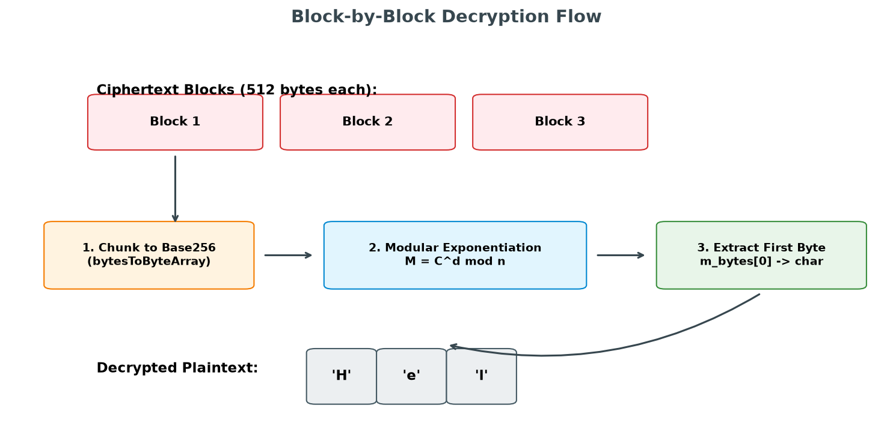

# RSA Decryption Deep Dive

This document details the block-by-block decryption process implemented in `decrypt.cpp` and how the original plaintext structure is recovered.

## Mathematical Core

To reverse the encryption operation and recover the message, the library performs the following modular exponentiation:

$$M \equiv C^d \pmod n$$

Where:
*   $C$ is the big integer represention of a ciphertext block.
*   $d$ is the private exponent computed during key generation.
*   $n$ is the 4096-bit modulus.
*   $M$ is the decrypted big integer containing the plain byte.

---

## The Decryption Process Flow

The ciphertext array is parsed in fixed-size blocks (e.g., 512 bytes for a 4096-bit key).



### Step-by-Step Execution:

1.  **Block Size Evaluation & Alignment Validation**
    Before processing, the library verifies that the ciphertext array size is a multiple of the active block size.
    ```cpp
    const size_t blockSize = keyPair.getPrivateKey().n.getBytes().size() * 8;
    if (blockSize == 0 || ciphertext.size() % blockSize != 0) {
        std::cerr << "Decryption error: Invalid ciphertext block size alignment." << std::endl;
        return plaintext;
    }
    ```
    If alignment is incorrect, execution stops to prevent reading out of bounds.

2.  **Chunk Parsing**
    The ciphertext is split into blocks of size `blockSize`. For each block, a 512-byte sub-vector is extracted:
    ```cpp
    std::vector<uint8_t> chunk(ciphertext.begin() + i, ciphertext.begin() + i + blockSize);
    ```

3.  **Big-Integer Reconstruction**
    The extracted byte array is converted back into the library's internal `Base256` representation:
    ```cpp
    const operations::Base256 c_num(bytesToByteArray(chunk));
    ```

4.  **Decryption Calculation**
    The modular exponentiation with the private exponent $d$ is executed:
    ```cpp
    operations::Base256 m_num = modPow(c_num, keyPair.getPrivateKey().d, keyPair.getPrivateKey().n);
    ```

5.  **Character Extraction**
    The big integer `m_num` is converted back to a raw byte stream. Because only one character was encrypted per block, the original byte is located at index 0 of the resulting array:
    ```cpp
    std::vector<uint8_t> m_bytes = byteArrayToBytes(m_num.getBytes());
    if (!m_bytes.empty()) {
        plaintext.push_back(static_cast<char>(m_bytes[0]));
    } else {
        plaintext.push_back('\0');  // Fallback for a zero-value block
    }
    ```

---

## Performance Considerations

Decryption is mathematically more computationally expensive than encryption because the private exponent $d$ is significantly larger than the public exponent $e$ (which is fixed to $65537$).

As a result, processing long plaintext strings character-by-character can introduce noticeable latency during decryption. This approach is intended for educational demonstrations of asymmetric encryption concepts.
```

---