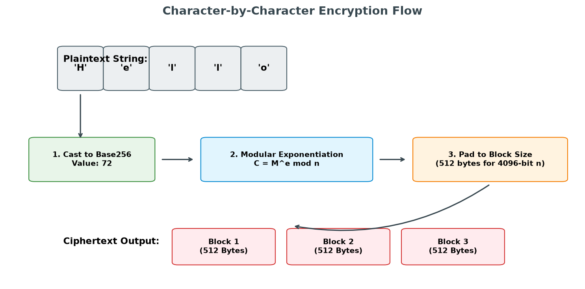

# RSA Encryption Deep Dive

This document details the character-by-character encryption process implemented in `encrypt.cpp` and explains its structural design.

## Mathematical Core

The core mathematical operation performed for encryption is the standard RSA formula:

$$C \equiv M^e \pmod n$$

Where:
*   $M$ is the message represented as a big integer (`Base256`).
*   $e$ is the public exponent (fixed at $65537$).
*   $n$ is the modulus ($p \times q$), which is 4096 bits in size.
*   $C$ is the resulting ciphertext integer.

---

## The Encryption Process Flow

The character-by-character design of this experimental library treats each individual 8-bit character in the plaintext as an independent block.



### Step-by-Step Execution:

1.  **Block Size Calculation**
    The block size (in bytes) is derived from the size of the modulus $n$ multiplied by 8 (since the big-integer library uses 64-bit limbs internally).
    ```cpp
    const size_t blockSize = keyPair.getPublicKey().n.getBytes().size() * 8;
    ```
    For a 4096-bit key, $n$ consists of 64 limbs (64-bit blocks). Therefore, `blockSize` is $64 \times 8 = 512$ bytes.

2.  **Character Conversion**
    Each character $c$ from the input string is cast to its raw byte value and imported into a `Base256` big-integer object:
    ```cpp
    const operations::Base256 m(static_cast<uint8_t>(c));
    ```

3.  **Modular Exponentiation**
    Using the `modPow` helper function, the byte is exponentiated to $e \pmod n$:
    ```cpp
    operations::Base256 c_num = modPow(m, keyPair.getPublicKey().e, keyPair.getPublicKey().n);
    ```

4.  **Padding and Extraction**
    The resulting big-integer representation is converted back into a little-endian byte array. Because $C$ is generally smaller than $n$, the byte array is padded up to the calculated `blockSize` (e.g., 512 bytes) using `byteArrayToBytes` to maintain block alignment in the output stream:
    ```cpp
    std::vector<uint8_t> c_bytes = byteArrayToBytes(c_num.getBytes(), blockSize);
    ```

5.  **Concatenation**
    The padded block of 512 bytes is appended to the total ciphertext array.

---

## Architectural Notes

*   **Data Expansion**: Because each single 1-byte character is encrypted into a complete $n$-sized block, there is a **512-to-1 data expansion ratio** when using a 4096-bit key. A 5-character string results in 2560 bytes of ciphertext.
*   **Educational Context**: This implementation serves as a functional demonstration of modular arithmetic and big-integer manipulation. For real-world production systems, modern hybrid systems (like AES-GCM combined with RSA-OAEP key encapsulation) are preferred to secure larger payloads and prevent side-channel leaks.
```