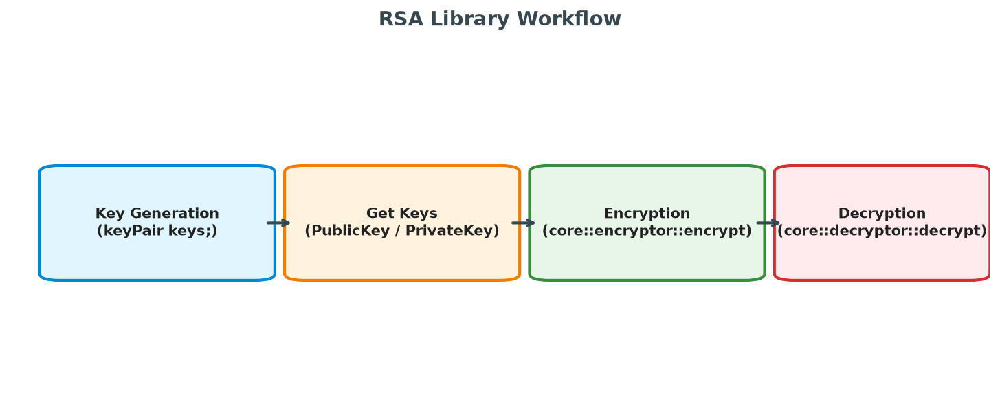

# Library Usage Guide

This document explains how to integrate, build, and use the RSA-style cryptographic library.

## Workflow Overview

The general cycle consists of generating a keypair, retrieving the public and private keys, executing the encryption/decryption routines, and optionally serializing keys for storage or transfer.



---

## 1. Quick Start Example

The original `README.md` demonstrated an object-oriented API that did not match the free functions defined in the codebase. Below is the updated, corrected usage code that directly calls `core::encryptor::encrypt` and `core::decryptor::decrypt`.

```cpp
#include <iostream>
#include <string>
#include <vector>

#include "keyPair.h"
#include "encrypt.h"
#include "decrypt.h"

int main() {
    try {
        // 1. Generate a new secure 4096-bit RSA keypair
        // Note: Prime generation uses the OS's secure RNG and takes a few moments.
        keyPair keys;

        std::string message = "hello";
        std::cout << "Original message: " << message << std::endl;

        // 2. Encrypt the plaintext using the public key stored in 'keys'
        std::vector<uint8_t> ciphertext = core::encryptor::encrypt(keys, message);
        std::cout << "Ciphertext size: " << ciphertext.size() << " bytes." << std::endl;

        // 3. Decrypt the ciphertext using the private key stored in 'keys'
        std::string decrypted = core::decryptor::decrypt(keys, ciphertext);
        std::cout << "Decrypted message: " << decrypted << std::endl;

    } catch (const std::exception& e) {
        std::cerr << "An error occurred: " << e.what() << std::endl;
        return 1;
    }
    return 0;
}
```


## 2. Key Serialization & Import

To save keys to a database, file, or send them over a network, you can serialize them into a Base64-encoded string format.

### Exporting Keys
```cpp
keyPair keys;

// Serialize public key to raw bytes, then encode to Base64
std::string pubBase64 = keyPair::base64Encode(keys.getPublicKey().serialize());

// Serialize private key to raw bytes, then encode to Base64
std::string privBase64 = keyPair::base64Encode(keys.getPrivateKey().serialize());
```

### Importing Keys
```cpp
// Initialize a keyPair by providing the Base64-encoded serialized keys
keyPair importedKeys(pubBase64, privBase64);
```